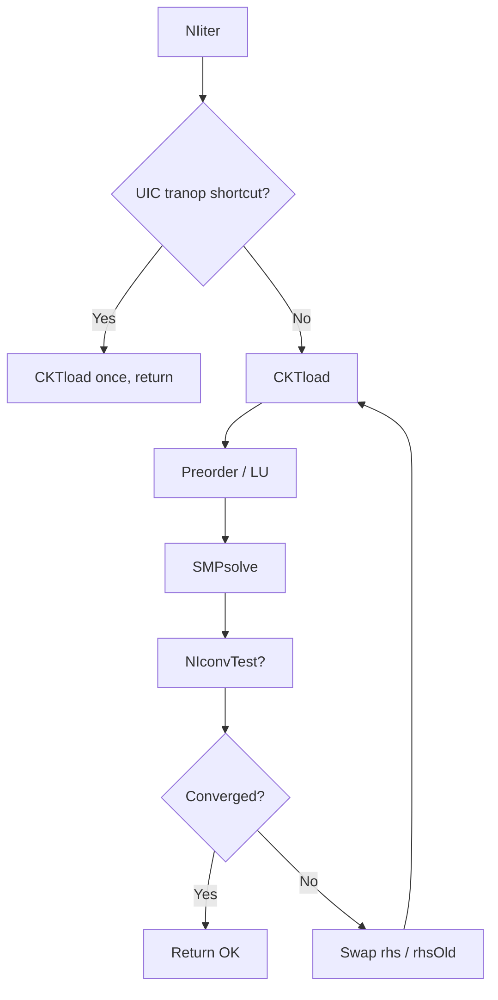

# Newton-Raphson iteration (NIiter) {#newton-raphson-iteration-niiter}

## Overview {#overview}

`NIiter` is ngspice’s core Newton loop for DC-style solves (operating point, inner transient steps, etc.). It repeatedly calls `CKTload`, factors/solves the sparse Jacobian with `SMP*` routines, updates the solution vector, applies optional node damping, and checks convergence via `NIconvTest` ([Source: src/maths/ni/niiter.c#L28-L314]).

<!-- source: src/maths/ni/niiter.c -->

## What This Module Does {#what-it-does}

On success it returns `OK` after incrementing `STATnumIter` with the number of Newton passes consumed ([Source: src/maths/ni/niiter.c#L279-L282]). On failure it returns `E_ITERLIM`, a sparse error, or an error propagated from `CKTload` / `NIreinit`.

## Algorithm In Detail {#algorithm}

1. **Early exits** — `MODETRANOP|MODEUIC` swaps RHS pointers, runs a single `CKTload`, and returns ([Source: src/maths/ni/niiter.c#L51-L59]).
2. **Initialization** — Optionally `NIreinit` when `NIUNINITIALIZED` ([Source: src/maths/ni/niiter.c#L67-L75]).
3. **Main `for(;;)`** — Clears `CKTnoncon`, calls `CKTload`, increments `iterno` ([Source: src/maths/ni/niiter.c#L79-L92]).
4. **Preorder** — First pass runs `SMPpreOrder` unless `NIDIDPREORDER` already set ([Source: src/maths/ni/niiter.c#L103-L114]).
5. **Reorder vs refactor** — If `NISHOULDREORDER`, `SMPreorder` with pivot tolerances + `CKTdiagGmin`; else `SMPluFac` ([Source: src/maths/ni/niiter.c#L120-L161]). Singular factors trigger reorder retries ([Source: src/maths/ni/niiter.c#L146-L151]).
6. **State bookkeeping** — Snapshot `CKTstate0` into `OldCKTstate0` before applying the solution ([Source: src/maths/ni/niiter.c#L165-L169]).
7. **RHS norm (diagnostics)** — Tracks `diag_nr_max_rhs` for optional NR telemetry ([Source: src/maths/ni/niiter.c#L171-L182]).
8. **Solve** — `SMPsolve` writes corrections; reference node equations forced to zero ([Source: src/maths/ni/niiter.c#L184-L200]).
9. **Iteration cap** — Compare `iterno` to `maxIter` (minimum 100, [Source: src/maths/ni/niiter.c#L45-L46, L202-L213]).
10. **Convergence** — If `CKTnoncon==0` and `iterno!=1`, call `NIconvTest`; else mark nonconverged ([Source: src/maths/ni/niiter.c#L215-L219]).
11. **Node damping** — Optional voltage/state blending ([Source: src/maths/ni/niiter.c#L225-L250]; see [Damped Newton](04_damped_newton_strategy.md)).
12. **Mode-dependent exit** — `MODEINITFLOAT` returns when `CKTnoncon==0`; other init modes adjust `CKTmode` and continue ([Source: src/maths/ni/niiter.c#L271-L306]).
13. **Swap RHS history** — Exchange `CKTrhs` / `CKTrhsOld` pointers for the next iterate ([Source: src/maths/ni/niiter.c#L308-L311]).

## Numerical Invariants {#invariants}

| Invariant | Specification | Source |
|-----------|---------------|--------|
| Minimum iteration budget | `maxIter = max(maxIter, 100)` | [Source: src/maths/ni/niiter.c#L45-L46] |
| Reference node clearing | After solve, indices `0` of RHS triple zeroed | [Source: src/maths/ni/niiter.c#L198-L200] |
| Convergence gate | Uses `NIconvTest` only if no device flagged `CKTnoncon` | [Source: src/maths/ni/niiter.c#L215-L219] |

## Mathematical Form {#math}

Each iteration solves \(J(x_k)\,\Delta x = -F(x_k)\) with \(J,F\) from `CKTload`, then updates \(x_{k+1} = x_k + \Delta x\) (subject to damping). `CKTrhs` holds the new iterate while `CKTrhsOld` stores the previous one for `NIconvTest` ([Source: src/maths/ni/niconv.c#L37-L44]).

## Failure Modes {#failure-modes}

- `E_ITERLIM` — iteration budget exhausted ([Source: src/maths/ni/niiter.c#L202-L213]).
- Sparse errors from `SMPreorder` / `SMPluFac` — includes singular matrix diagnostics ([Source: src/maths/ni/niiter.c#L120-L160]).
- `E_INTERN` — impossible `CKTmode` combination ([Source: src/maths/ni/niiter.c#L298-L305]).

## Diagrams {#diagrams}



## NodalAI Equivalent {#nodalai-equivalent}

```python
def ni_iter(ckt, max_iter: int) -> int:
    max_iter = max(max_iter, 100)
    iterno = 0
    while True:
        ckt_load(ckt); iterno += 1
        factor_or_reorder(ckt.matrix)
        delta = sparse_solve(ckt.matrix, ckt.rhs)
        apply_damping_if_needed(ckt, iterno)
        if converged(ckt, iterno):
            return OK
        if iterno > max_iter:
            return E_ITERLIM
        swap(ckt.rhs, ckt.rhs_old)
```

## Related Chapters {#related-chapters}

- [CKTload](01_circuit_load_dispatch_cktload.md)
- [Convergence anatomy](03_convergence_test_anatomy.md)
- [DC OP chain](../23_canonical_chains_reference/01_dc_operating_point_chain.md)

## Canonical Chains {#canonical-chains}

- `dc_operating_point_chain`, `transient_step_chain`, `sparse_solve_chain`
