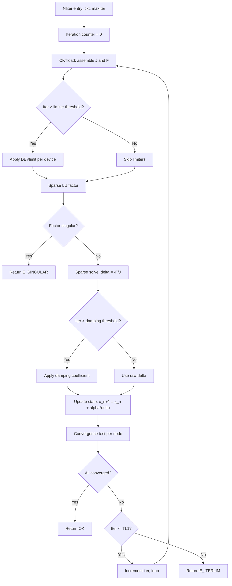

# Task: Generate RAG-Friendly Markdown Documentation for ngspice (Dual-Mission)

You are an expert SPICE simulator implementer with deep knowledge of ngspice's numerical kernel, device modeling, sparse matrix solvers, and circuit simulation theory. Generate a structured tree of Markdown documentation under `docs/ngspice_book/` that explains ngspice's architecture in book form, organized to serve **two distinct retrieval missions** from the same documentation tree:

1. **NodalAI Kernel Reimplementation Oracle** — the agent reimplementing ngspice's numerical kernel in Python needs documentation that surfaces exact algorithms, numerical invariants, and canonical call chains, with citations to the C source.
2. **Agentic Circuit Design and Validation Platform** — a different agent designs circuits, runs simulations, interprets results. It needs documentation that explains netlist syntax, analysis directives, output formats, common pitfalls, from a user perspective rather than an implementer perspective.

The documentation is itself ingested into the same RAG that already has `rag_index.json`. Every design choice — file structure, front-matter, section headings, cross-references — is in service of RAG retrieval quality for both missions.

## Inputs
- The ngspice source tree (root of the repo)
- An existing `rag_index.json` at the repo root containing per-file metadata, mission relevance tags (`job_relevance`), numerical invariant tags, SPICEdev function implementations, canonical chains (Mission-1 and Mission-2 families), and the glossary. **Read it first.** Reuse its metadata everywhere — do not re-derive what's already extracted.

## Outputs
A single artifact: `docs/ngspice_book/` directory tree with all .md files plus a `_meta/` subdirectory of machine-readable cross-reference data.

---

## Documentation Structure

Generate exactly this directory tree. Chapter ordering reflects the natural reading path: foundation → kernel implementation (Mission 1 weight) → device models (Mission 1 weight) → user-facing simulator (Mission 2 weight) → validation and debugging (both missions).

````
docs/ngspice_book/
├── INDEX.md                                    # Master TOC + book overview + mission reading paths
├── 00_foundations/
│   ├── README.md
│   ├── 01_what_is_spice_and_ngspice.md
│   ├── 02_modified_nodal_analysis_mna.md       # The mathematical foundation
│   ├── 03_newton_raphson_for_nonlinear_circuits.md
│   ├── 04_sparse_matrix_in_circuit_simulation.md
│   ├── 05_numerical_integration_for_transient.md
│   └── 06_dual_mission_reading_guide.md        # NodalAI vs circuit-design paths
├── 01_architecture_overview/
│   ├── README.md
│   ├── 01_layered_architecture.md              # frontend → spicelib → devices → math
│   ├── 02_data_structures_cktcircuit.md        # CKTcircuit, CKTnode, GENinstance
│   ├── 03_spicedev_plugin_contract.md          # The device plugin pattern
│   ├── 04_function_pointer_dispatch.md         # DEVices[type]->DEVload pattern
│   ├── 05_shared_library_mode.md               # sharedspice.c, embedding ngspice
│   └── 06_directory_structure_walkthrough.md
├── 02_numerical_kernel_core/
│   ├── README.md
│   ├── 01_circuit_load_dispatch_cktload.md     # How CKTload dispatches per-device
│   ├── 02_newton_raphson_iteration_niiter.md
│   ├── 03_convergence_test_anatomy.md          # RELTOL/ABSTOL/VNTOL/CHGTOL math
│   ├── 04_damped_newton_strategy.md
│   ├── 05_voltage_limiting_devpnjlim.md        # Junction limiter math
│   ├── 06_voltage_limiting_devfetlim.md        # FET limiter math
│   ├── 07_matrix_singularity_handling.md
│   └── 08_kernel_invariants_summary.md         # The "must preserve" list for reimplementation
├── 03_analysis_drivers/
│   ├── README.md
│   ├── 01_dc_operating_point_dcop.md
│   ├── 02_dc_sweep_dctrcurv.md
│   ├── 03_transient_dctran.md
│   ├── 04_ac_small_signal_acan.md
│   ├── 05_noise_analysis_noisean.md
│   ├── 06_distortion_volterra_disto.md
│   ├── 07_transfer_function_tfan.md
│   ├── 08_sensitivity_adjoint_senan.md
│   ├── 09_pole_zero_pzan.md
│   └── 10_fourier_post_processing.md
├── 04_convergence_aids/
│   ├── README.md
│   ├── 01_convergence_aid_ladder.md            # Standard NR → GMIN → source step → pseudo-transient
│   ├── 02_gmin_stepping_mechanics.md
│   ├── 03_source_stepping_mechanics.md
│   ├── 04_pseudo_transient_mechanics.md
│   ├── 05_itl_iteration_limit_options.md       # ITL1, ITL2, ITL4 semantics
│   └── 06_convergence_failure_diagnosis.md     # Mission-2 perspective (overlap)
├── 05_numerical_integration/
│   ├── README.md
│   ├── 01_trapezoidal_integration.md
│   ├── 02_gear_method_orders_2_to_6.md
│   ├── 03_backward_euler.md
│   ├── 04_charge_conserving_capacitor_stamps.md
│   ├── 05_lte_estimation_devtrunc.md
│   ├── 06_timestep_control_law.md
│   └── 07_breakpoint_handling.md
├── 06_sparse_solver/
│   ├── README.md
│   ├── 01_sparse_matrix_data_structure.md
│   ├── 02_sparse_lu_factorization.md           # spFactor algorithm
│   ├── 03_partial_pivoting_strategy.md
│   ├── 04_ordering_heuristic.md
│   ├── 05_solve_phase_spsolve.md
│   ├── 06_klu_alternative.md                   # KLU integration if vendored
│   └── 07_sparse_solver_invariants.md          # What NodalAI must preserve
├── 07_device_model_contract/
│   ├── README.md
│   ├── 01_spicedev_struct_anatomy.md           # The full SPICEdev contract
│   ├── 02_devparam_parameter_handling.md
│   ├── 03_devload_load_function.md             # The most important function
│   ├── 04_devacload_ac_linearization.md
│   ├── 05_devtrunc_lte_per_device.md
│   ├── 06_devconvtest_per_device_convergence.md
│   ├── 07_devlimit_per_device_limiting.md
│   ├── 08_devtemperature_temp_resolution.md
│   ├── 09_devsens_sensitivity_per_device.md
│   ├── 10_devnoise_noise_psd_per_device.md
│   └── 11_writing_a_new_device_model.md        # Template for new device authoring
├── 08_passive_devices/
│   ├── README.md
│   ├── 01_resistor.md
│   ├── 02_capacitor.md
│   ├── 03_inductor_and_mutual.md
│   ├── 04_transmission_line_lossless_tra.md
│   ├── 05_transmission_line_lossy_ltra.md
│   ├── 06_transmission_line_simple_txl.md
│   └── 07_uniform_rc_urc.md
├── 09_source_devices/
│   ├── README.md
│   ├── 01_independent_voltage_source.md
│   ├── 02_independent_current_source.md
│   ├── 03_vcvs_e_element.md
│   ├── 04_vccs_g_element.md
│   ├── 05_ccvs_h_element.md
│   ├── 06_cccs_f_element.md
│   ├── 07_behavioral_source_b_element.md
│   ├── 08_voltage_controlled_switch_s.md
│   └── 09_current_controlled_switch_w.md
├── 10_diode_and_bjt_models/
│   ├── README.md
│   ├── 01_diode_model.md
│   ├── 02_bjt_gummel_poon.md
│   ├── 03_bjt_vbic.md
│   └── 04_bjt_hicum2.md
├── 11_mosfet_models/
│   ├── README.md
│   ├── 01_mosfet_levels_1_2_3.md               # Original SPICE MOS models
│   ├── 02_mosfet_level_6_9.md                  # Mid-generation
│   ├── 03_bsim3.md
│   ├── 04_bsim4.md                             # The flagship
│   ├── 05_bsim6.md                             # If present
│   ├── 06_ekv.md
│   ├── 07_hisim2.md
│   ├── 08_hisim_hv2.md
│   ├── 09_charge_handling_across_models.md     # Cross-cutting: charge conservation
│   └── 10_choosing_a_mosfet_model.md           # Mission-2 perspective
├── 12_jfet_mesfet_models/
│   ├── README.md
│   ├── 01_jfet_level1.md
│   ├── 02_jfet_level2.md
│   ├── 03_mesfet_curtice.md
│   ├── 04_mesfet_statz.md
│   └── 05_mesfet_hfet.md
├── 13_xspice_mixed_signal/
│   ├── README.md
│   ├── 01_xspice_event_driven_overview.md      # Skip if XSPICE excluded from index
│   ├── 02_event_node_types.md
│   ├── 03_code_models.md
│   ├── 04_analog_digital_interfacing.md
│   └── 05_user_defined_code_models.md
├── 14_netlist_grammar/
│   ├── README.md
│   ├── 01_netlist_overall_structure.md
│   ├── 02_device_card_grammar.md               # R/L/C/D/Q/M/V/I/B/E/F/G/H/X
│   ├── 03_dotcommand_overview.md
│   ├── 04_dot_op_dot_dc.md
│   ├── 05_dot_ac.md
│   ├── 06_dot_tran.md
│   ├── 07_dot_noise_dot_disto.md
│   ├── 08_dot_tf_dot_sens_dot_pz.md
│   ├── 09_dot_subckt_dot_ends.md
│   ├── 10_dot_param_parameterization.md
│   ├── 11_dot_options_directive.md
│   ├── 12_dot_ic_dot_nodeset.md
│   ├── 13_dot_save_dot_print_dot_plot.md
│   ├── 14_dot_measure.md
│   └── 15_dot_control_block.md
├── 15_parser_and_expansion/
│   ├── README.md
│   ├── 01_netlist_tokenization.md
│   ├── 02_dotcommand_dispatch.md
│   ├── 03_subcircuit_expansion_mechanics.md
│   ├── 04_parameter_substitution_numparam.md
│   ├── 05_expression_evaluator.md
│   └── 06_parser_error_handling.md
├── 16_command_interpreter/
│   ├── README.md
│   ├── 01_nutmeg_spice3_command_overview.md
│   ├── 02_simulation_run_commands.md           # run, op, dc, ac, tran
│   ├── 03_vector_manipulation_commands.md
│   ├── 04_plot_print_commands.md
│   ├── 05_control_block_scripting.md
│   ├── 06_breakpoints_and_alter.md
│   └── 07_save_load_state.md
├── 17_output_and_results/
│   ├── README.md
│   ├── 01_vector_data_model.md                 # dvec, plot
│   ├── 02_raw_file_format_spec.md              # Critical: external consumers parse this
│   ├── 03_print_format_text_output.md
│   ├── 04_measure_extraction_idioms.md
│   ├── 05_fft_command.md
│   └── 06_consuming_raw_with_pyspice.md        # External integration
├── 18_options_and_tolerances/
│   ├── README.md
│   ├── 01_options_overview.md                  # All .options
│   ├── 02_tolerance_options_reltol_abstol_vntol_chgtol.md
│   ├── 03_iteration_limit_options_itl.md
│   ├── 04_gmin_and_gminsteps.md
│   ├── 05_method_options_trap_gear.md
│   ├── 06_temperature_options.md
│   ├── 07_print_save_options.md
│   └── 08_options_in_practice.md
├── 19_circuit_design_patterns/
│   ├── README.md
│   ├── 01_typical_dc_op_workflow.md            # Mission-2 oriented
│   ├── 02_typical_transient_workflow.md
│   ├── 03_typical_ac_workflow.md
│   ├── 04_parametric_sweep_idioms.md
│   ├── 05_monte_carlo_idioms.md
│   ├── 06_optimization_outer_loop_patterns.md
│   ├── 07_subcircuit_design_pattern.md
│   └── 08_temperature_corner_analysis.md
├── 20_debugging_workflows/
│   ├── README.md
│   ├── 01_dc_op_no_convergence.md              # The classic problem
│   ├── 02_timestep_too_small.md
│   ├── 03_singular_matrix_error.md
│   ├── 04_charge_non_conservation_artifacts.md
│   ├── 05_unrealistic_results.md
│   ├── 06_oscillation_in_simulation_not_circuit.md
│   ├── 07_convergence_aid_directive_sequence.md  # Order to try options
│   ├── 08_diagnosing_via_print_intermediate.md
│   ├── 09_initial_conditions_misuse.md
│   └── 10_subcircuit_naming_collision.md
├── 21_validation_with_regression_suite/
│   ├── README.md
│   ├── 01_regression_suite_organization.md
│   ├── 02_running_regression_tests.md
│   ├── 03_reading_reference_outputs.md
│   ├── 04_using_tests_for_nodalai_validation.md  # Mission-1 specific
│   └── 05_writing_a_new_regression_test.md
├── 22_nodalai_kernel_reimplementation/
│   ├── README.md                               # Mission-1 dedicated chapter
│   ├── 01_nodalai_overview_and_scope.md
│   ├── 02_porting_strategy_layer_by_layer.md
│   ├── 03_python_equivalents_for_c_kernel.md   # scipy.sparse.linalg, etc.
│   ├── 04_invariants_checklist.md              # Aggregated must-preserve list
│   ├── 05_validation_against_ngspice_reference.md
│   ├── 06_handling_indirect_dispatch_in_python.md  # Equivalent of DEVices[]
│   ├── 07_porting_bsim4_pragmatically.md       # Or partial subset
│   └── 08_known_porting_pitfalls.md
├── 23_canonical_chains_reference/
│   ├── README.md
│   ├── 01_dc_operating_point_chain.md          # End-to-end walk of each chain
│   ├── 02_transient_step_chain.md
│   ├── 03_ac_analysis_chain.md
│   ├── 04_device_load_dispatch_chain.md
│   ├── 05_convergence_aid_chain.md
│   ├── 06_sparse_solve_chain.md
│   ├── 07_netlist_to_simulation_chain.md
│   ├── 08_convergence_failure_diagnosis_chain.md
│   ├── 09_measure_extraction_chain.md
│   └── 10_raw_output_consumption_chain.md
├── 24_glossary/
│   ├── README.md
│   ├── 01_numerical_kernel_terms.md
│   ├── 02_device_modeling_terms.md
│   ├── 03_frontend_circuit_design_terms.md
│   ├── 04_options_and_tolerances_terms.md
│   ├── 05_output_format_terms.md
│   └── 06_mission_bridging_terms.md
└── _meta/
    ├── chapter_map.json
    ├── cross_reference_index.json
    ├── source_file_attribution.json
    └── mission_coverage_matrix.json            # Per-chapter mission relevance
````

**Coverage rule**: Every chapter referenced above must be generated. If during scan you find that the actual code does not support some section (e.g., BSIM6 isn't actually present in this branch), drop the section file and note the absence honestly in the chapter README and master INDEX. Do not invent content. If you discover content that doesn't fit any chapter, add a section to the closest fit and note it in INDEX.md.

If `rag_index.json` indicates XSPICE was excluded from indexing (per the Tier-2 inclusion decision in the index prompt), drop Chapter 13 entirely and note in INDEX.md.

---

## Per-File Markdown Format

Every .md file follows this structure exactly. The format is engineered for RAG chunking — front-matter is parseable metadata, headings have stable anchors, sections are predictable retrieval targets.

### YAML Front-Matter (every file)

````markdown
---
title: "Newton-Raphson Iteration: NIiter Anatomy"
chapter: "02_numerical_kernel_core"
section: "02_newton_raphson_iteration_niiter"
section_number: "2.2"
topic: "newton_raphson_iteration"
mission_primary: "kernel_reimplementation"
mission_secondary: ["circuit_design_validation"]
related_files:
  - "src/spicelib/analysis/niiter.c"
  - "src/spicelib/analysis/niconv.c"
  - "src/spicelib/analysis/cktload.c"
related_chapters:
  - "02_numerical_kernel_core/01_circuit_load_dispatch_cktload.md"
  - "02_numerical_kernel_core/03_convergence_test_anatomy.md"
  - "04_convergence_aids/01_convergence_aid_ladder.md"
  - "23_canonical_chains_reference/01_dc_operating_point_chain.md"
domain_concepts:
  - "newton_raphson"
  - "convergence_test"
  - "damped_newton"
  - "reltol_abstol_vntol_chgtol"
canonical_chain_tags:
  - "dc_operating_point_chain"
  - "transient_step_chain"
  - "device_load_dispatch_chain"
  - "convergence_aid_chain"
numerical_invariants_introduced:
  - "newton_raphson_iteration"
  - "convergence_test"
  - "damped_newton"
glossary_terms_introduced:
  - "Newton-Raphson iteration"
  - "Damped Newton step"
  - "ITL1 / ITL2 iteration limits"
audience: ["NodalAI reimplementer", "Spectrum core developer of ngspice", "advanced circuit designer"]
estimated_reading_minutes: 12
last_updated_from_source_at: "<ISO 8601 of latest cited source mtime>"
---
````

Field requirements:
- `title`, `chapter`, `section`, `section_number`, `topic` — always set
- `mission_primary` — one of: `"kernel_reimplementation"`, `"circuit_design_validation"`, `"both"`. The mission this section is *primarily* for.
- `mission_secondary` — list of other missions this section is also useful for. Used by RAG retrieval to broaden when needed.
- `related_files` — paths from the actual source tree, validated against `rag_index.json#files`
- `related_chapters` — repo-relative paths to other .md files; bidirectional cross-linking expected
- `domain_concepts` — terms from `rag_index.json#domain_concepts` controlled vocabulary
- `canonical_chain_tags` — chain IDs from `rag_index.json#canonical_chains`
- `numerical_invariants_introduced` — IDs from `rag_index.json` numerical_invariant_kind enum (Mission-1-relevant sections only)
- `glossary_terms_introduced` — terms this section is the first/primary place to define
- `audience` — at least one of: `"NodalAI reimplementer"`, `"ngspice core developer"`, `"advanced circuit designer"`, `"new circuit designer"`, `"agent operating circuit-design platform"`
- `estimated_reading_minutes` — honest estimate, 5–20 typical
- `last_updated_from_source_at` — ISO 8601 of latest mtime among cited source files

### Body Section Structure (Mission-1-heavy chapters: kernel, devices, integration, sparse)

Standard skeleton:

````markdown
# Newton-Raphson Iteration: NIiter Anatomy {#niiter-anatomy}

## Overview {#overview}

[2–4 paragraphs explaining what this section covers in plain language. State the function's role in the simulator's correctness — for NIiter, it's the inner Newton-Raphson loop that drives every DC-style and transient analysis to a converged solution. Cite source files in HTML comments.]

<!-- source: src/spicelib/analysis/niiter.c -->

## What This Module Does {#what-it-does}

[1–2 paragraphs on the function's specific responsibility. Refer to it by its actual symbol name. State input state, output state, and the invariant it preserves on success.]

## Algorithm In Detail {#algorithm}

[Step-by-step walkthrough of the algorithm with line citations. Use real method names from the source.]

1. **Iteration setup** ([Source: src/spicelib/analysis/niiter.c#L56-L82]) — At entry, NIiter receives the CKTcircuit pointer and a max-iteration count. It initializes the iteration counter and enters the main NR loop.
2. **CKTload dispatch** ([Source: src/spicelib/analysis/niiter.c#L94-L102, calls src/spicelib/analysis/cktload.c#L48]) — Each iteration begins by calling CKTload, which iterates over every device in the circuit and dispatches via the SPICEdev function pointer table to per-device DEVload functions. This assembles the Jacobian and RHS for the current voltage/current state.
3. **Limiter application** ([Source: src/spicelib/analysis/niiter.c#L110-L135]) — If iteration count exceeds a threshold, voltage/current limiters are applied per device via DEVlimit calls. Limiters dampen oscillation between iterations.
4. **Sparse factor and solve** ([Source: src/spicelib/analysis/niiter.c#L155-L172, calls src/maths/sparse/spfactor.c, src/maths/sparse/spsolve.c]) — The Jacobian is LU-factored with partial pivoting, then forward/back-substituted to compute the iteration update.
5. **Damping** ([Source: src/spicelib/analysis/niiter.c#L180-L210]) — If the iteration delta exceeds limits or oscillation is detected, a damping coefficient is applied to the update before applying it to the state vector.
6. **Convergence test** ([Source: src/spicelib/analysis/niiter.c#L218-L260, calls src/spicelib/analysis/niconv.c]) — Per-node convergence is checked using the RELTOL/ABSTOL/VNTOL/CHGTOL test. If all nodes pass, NIiter returns success. If iteration count exceeds ITL1/ITL2 limits, returns failure.

## Numerical Invariants {#invariants}

[Tabulate the invariants this function preserves. This is gold for NodalAI reimplementation.]

| Invariant | Specification | Source |
|---|---|---|
| Convergence test (per node) | `\|delta_v\| < RELTOL × max(\|v_new\|, \|v_old\|) + VNTOL` for voltage nodes; `\|delta_i\| < RELTOL × max(\|i_new\|, \|i_old\|) + ABSTOL` for current branches | niiter.c#L218-L260, niconv.c#L42-L88 |
| Default tolerances | RELTOL=1e-3, ABSTOL=1e-12, VNTOL=1e-6, CHGTOL=1e-14 | cktdefs.h#L342-L350 |
| Iteration limits | ITL1=100 (DC default), ITL2=50 (DC continuation), ITL4=10 (transient per-step) | cktdefs.h#L356-L362 |
| Damping threshold | Damping kicks in when iteration > XMU; coefficient is XMU × delta | niiter.c#L180-L210 |

## Mathematical Form {#math}

[Formal mathematical statement of what the function computes.]

The Newton-Raphson update for the nonlinear system **F(x) = 0** is:

$$x_{n+1} = x_n - J^{-1}(x_n) F(x_n)$$

where **J** is the Jacobian. NIiter implements this as:
1. Build **J** and **F** via CKTload (which calls every device's DEVload to stamp local Jacobian and RHS contributions)
2. Solve `J · delta = -F` via sparse LU
3. Update `x_{n+1} = x_n + alpha · delta`, where `alpha` is the damping coefficient (1.0 unconverged early, < 1.0 with damping)
4. Test convergence: `|delta_i| < RELTOL · max(|x_{n+1,i}|, |x_{n,i}|) + tolerance_i` for each variable

## Failure Modes and Fallbacks {#failure-modes}

[What happens when NIiter fails to converge. Critical for both missions.]

- **`NIiter` returns `E_ITERLIM`**: hit ITL1/ITL2 without convergence. Caller (CKTop or DCtran) decides whether to fall back. CKTop's fallback is GMIN stepping, then source stepping. DCtran's fallback is timestep reduction.
- **Sparse factor returns `E_SINGULAR`**: matrix structurally singular. Usually means missing DC path to ground in the netlist, or floating node. NIiter aborts the iteration and returns the error upward.
- **Limiter oscillation**: even with damping, some pathological circuits oscillate between iterations indefinitely. Standard NR can't fix this — caller must use convergence aids.

## Common Reimplementation Pitfalls {#reimplementation-pitfalls}

[Mission-1 specific. What goes wrong when porting this to Python.]

- **Using a fixed damping coefficient instead of XMU-thresholded**: produces slower convergence on benign circuits and worse convergence on hard ones. The threshold is essential.
- **Computing convergence test with one global tolerance instead of per-node-type**: voltage nodes use VNTOL, current branches use ABSTOL — these are different units (V vs A) and different magnitudes. Mixing them produces wrong convergence behavior.
- **Forgetting limiter calls in early iterations**: limiters are skipped on iteration 0 (no previous state); applying them too eagerly pessimizes convergence on benign circuits.
- **Not resetting the iteration vector on retry**: if NIiter fails and the caller retries with an aid (GMIN step), the iteration must restart from a clean baseline, not the failed state.

## Source Files {#source-files}

- **`src/spicelib/analysis/niiter.c`** — Main NIiter function. ~412 lines. NIiter (DC iteration), NIacIter (AC iteration variant).
- **`src/spicelib/analysis/niconv.c`** — Convergence test (NIconvTest). Per-node convergence evaluation.
- **`src/spicelib/analysis/cktload.c`** — CKTload, the dispatch layer NIiter calls each iteration.
- **`src/include/ngspice/cktdefs.h`** — CKTcircuit structure definition; tolerance and ITL macro definitions.

## Diagrams {#diagrams}



## NodalAI Equivalent {#nodalai-equivalent}

[Mission-1 specific section, present in kernel chapters. Suggest Python equivalents.]

In a Python reimplementation, NIiter becomes a function with this approximate signature:

```python
def ni_iter(ckt: Circuit, max_iter: int = 100) -> ConvergeResult:
    for it in range(max_iter):
        J, F = ckt_load(ckt)                      # Builds scipy.sparse Jacobian and dense RHS
        if it > LIMITER_THRESHOLD:
            apply_dev_limits(ckt)
        try:
            lu = sparse.linalg.splu(J)
            delta = -lu.solve(F)
        except RuntimeError:                      # Singular matrix
            return ConvergeResult.SINGULAR
        if it > DAMPING_THRESHOLD:
            delta *= damping_coefficient(ckt, delta)
        ckt.state += delta
        if convergence_test(ckt, delta):
            return ConvergeResult.OK
    return ConvergeResult.ITERLIM
```

Notes for porting:
- `sparse.linalg.splu` replaces ngspice's spFactor + spSolve; it's slower but vastly easier to maintain
- Convergence test must be per-node-type (voltage vs current) — implement as `convergence_test(ckt, delta)` that walks ckt.nodes and applies the right tolerance per node type
- `apply_dev_limits` requires per-device `DEVlimit` implementations — see [Chapter 7, Section 7](../07_device_model_contract/07_devlimit_per_device_limiting.md)

## Related Chapters {#related-chapters}

- [Circuit Load Dispatch (CKTload)](01_circuit_load_dispatch_cktload.md) — the function NIiter calls each iteration
- [Convergence Test Anatomy](03_convergence_test_anatomy.md) — the test NIiter applies after each step
- [Convergence Aid Ladder](../04_convergence_aids/01_convergence_aid_ladder.md) — what happens when NIiter fails
- [DC Operating Point Chain](../23_canonical_chains_reference/01_dc_operating_point_chain.md) — how NIiter fits in the full chain

## Canonical Chains {#canonical-chains}

NIiter participates in:
- `dc_operating_point_chain` — see `rag_index.json#canonical_chains.dc_operating_point_chain`
- `transient_step_chain`
- `device_load_dispatch_chain` (it's the caller of CKTload)
- `convergence_aid_chain` (its failure triggers the aid ladder)

## Glossary Terms Introduced {#glossary}

- **Newton-Raphson iteration** — Iterative method for solving nonlinear equations F(x) = 0 by linearizing at each step. → [glossary/01_numerical_kernel_terms.md#newton-raphson-iteration](../24_glossary/01_numerical_kernel_terms.md#newton-raphson-iteration)
- **Damped Newton step** — NR update modified by a coefficient < 1.0 to prevent oscillation in difficult circuits. → [glossary/01_numerical_kernel_terms.md#damped-newton-step](../24_glossary/01_numerical_kernel_terms.md#damped-newton-step)
- **ITL1 / ITL2 iteration limits** — Maximum NR iterations allowed in initial DC pass (ITL1) and continuation passes (ITL2). → [glossary/04_options_and_tolerances_terms.md#itl1-itl2](../24_glossary/04_options_and_tolerances_terms.md#itl1-itl2)
````

### Body Section Structure (Mission-2-heavy chapters: netlist grammar, command interpreter, design patterns, debugging)

Mission-2 sections use a slightly different skeleton emphasizing user-facing semantics:

````markdown
# .tran Transient Analysis Directive {#dot-tran}

## Overview {#overview}

[Plain-language explanation of what .tran does and when a circuit designer uses it.]

<!-- source: src/frontend/inpdot.c -->

## Syntax {#syntax}

[Exact syntax with all options, citing the parser source for ground truth.]

````
.tran tstep tstop [tstart [tmax]] [UIC]
````

| Field | Meaning | Default | Source |
|---|---|---|---|
| `tstep` | Print step size (also influences output sampling) | required | inpdot.c#L382 |
| `tstop` | Simulation end time | required | inpdot.c#L389 |
| `tstart` | Output start time (sim runs from 0 to tstop, but data emitted only after tstart) | 0 | inpdot.c#L396 |
| `tmax` | Maximum internal timestep allowed (cap on adaptive stepping) | (tstop-tstart)/50 | inpdot.c#L403 |
| `UIC` | Use Initial Conditions: skip DC operating point, start from .ic values | absent | inpdot.c#L411 |

## What Actually Runs {#what-runs}

[Trace from .tran parsing through to the actual simulation. Both missions benefit from this.]

When `.tran` is parsed, the parser builds a TRANanal structure with the parameters and registers it as the analysis to run. When simulation starts, `DCtran` is called as the analysis driver. Its main loop:

1. **DC operating point first** (unless UIC) — calls CKTop to get an initial state
2. **Transient main loop**: predictor → DEVload with charge stamps → NIiter → LTE estimation → step accept/reject → next step

For implementer detail, see [Chapter 3, Section 3](../03_analysis_drivers/03_transient_dctran.md). For the full numerical chain, see [Chapter 23, Section 2](../23_canonical_chains_reference/02_transient_step_chain.md).

## Common Usage Patterns {#patterns}

[Real-world usage idioms — Mission 2 gold.]

```spice
* Standard transient: 1us step, 10ms duration
.tran 1u 10m

* Skip first 5ms of output (settling time)
.tran 1u 10m 5m

* Cap internal timestep to prevent missing fast events
.tran 1u 10m 0 100n

* Skip DC op (use when DC won't converge)
.tran 1u 10m UIC
```

## Common Pitfalls {#pitfalls}

[Failure modes from a designer perspective.]

- **`tstep` too small relative to `tstop` produces huge output files.** Print step is sampling rate; internal timestep is adaptive. For 100ms simulation with 1ns print step, you get 100M data points — usually unwanted.
- **`UIC` skips DC op and starts cold.** Good for circuits whose DC won't converge but have well-defined initial conditions. Bad if you need DC bias resolved — your transient starts from x=0 and may produce nonsensical early samples.
- **`tmax` too generous lets adaptive stepper miss fast events.** If the circuit has a 10ns rise time but tmax = 1us, the stepper may take 1us steps and miss the edge entirely.
- **No DC ground reference produces "Singular matrix" before transient starts.** Even with UIC, the transient solver needs a topology where matrix is non-singular at every step.

## Verification Checklist {#verification-checklist}

- [ ] Confirm `tstep` × N data points is a tractable file size for your downstream tools
- [ ] If using UIC, confirm `.ic` statements set all critical node voltages
- [ ] If circuit has fast edges, set `tmax` to ~1/10 of the fastest expected timescale
- [ ] If sim emits "Timestep too small," see [Chapter 20, Section 2](../20_debugging_workflows/02_timestep_too_small.md)

## Source Files {#source-files}

- **`src/frontend/inpdot.c`** — `.tran` parser dispatch.
- **`src/spicelib/analysis/dctran.c`** — Transient analysis driver invoked when sim starts.

## Related Chapters {#related-chapters}

- [Transient Analysis Driver Implementation](../03_analysis_drivers/03_transient_dctran.md) — for implementers
- [Charge Conservation in Transient](../05_numerical_integration/04_charge_conserving_capacitor_stamps.md)
- [Timestep Too Small Debugging](../20_debugging_workflows/02_timestep_too_small.md)

## Canonical Chains {#canonical-chains}

- `transient_step_chain`
- `netlist_to_simulation_chain`
````

### Body Section Structure (Device chapters: BSIM4, etc.)

Device model chapters get a structure emphasizing the SPICEdev contract:

````markdown
# BSIM4 MOSFET Model {#bsim4}

## Overview {#overview}

[What BSIM4 is, why it exists, what physics it captures.]

## Model Family Position {#family}

[Where BSIM4 sits among MOSFET models — vs BSIM3, vs BSIM6, vs HiSIM.]

## SPICEdev Functions Implemented {#spicedev-functions}

| Function | File | Purpose |
|---|---|---|
| DEVparam | bsim4/b4par.c | Parse model card parameters |
| DEVload | bsim4/b4ld.c | Compute Ids, charges, stamps for transient/DC |
| DEVacLoad | bsim4/b4acld.c | Linearized stamps for AC |
| DEVtemperature | bsim4/b4temp.c | Temperature-dependent parameter resolution |
| DEVconvTest | bsim4/b4cvtest.c | Per-device convergence test |
| ... | ... | ... |

## Physics {#physics}

[High-level physics summary — surface potential vs threshold-voltage approaches, DIBL, mobility model, velocity saturation, charge model, gate tunneling.]

## Key Equations {#equations}

[The core equations BSIM4 evaluates, with line citations to b4ld.c.]

## Model Parameters {#parameters}

[Reference table of important parameters with physical meaning.]

| Parameter | Symbol | Default | Physical Meaning | Typical Range |
|---|---|---|---|---|
| `vth0` | Vth0 | 0.7 | Long-channel threshold voltage at zero Vbs | 0.3–0.9 V (NMOS) |
| ... | ... | ... | ... | ... |

[For BSIM4 specifically, mention there are 100+ parameters; this section lists the ones a designer touches most often, full reference is in the model card files in test suite.]

## Voltage Limiting {#limiting}

[How BSIM4 implements DEVfetlim. Source citation.]

## Charge Conservation {#charge}

[How transcapacitances are stamped. Why this matters.]

## Common Failure Modes {#failure-modes}

- **Convergence failure with high gain stage**: high gm·rds in active region produces ill-conditioned Jacobian. Try increasing GMIN or limiting Vds.
- **Negative Ids in cutoff**: numerical artifact when subthreshold current is computed near machine precision. Usually benign but can confuse measure statements.
- **Charge non-conservation in fast transients**: BSIM4 includes capacitance models that should conserve charge but require accurate timestep control. If you see drifting node voltages, check transcapacitance flag.

## NodalAI Reimplementation Notes {#nodalai}

[Mission-1 perspective: which BSIM4 features are tractable to port and which are pragmatically deferred.]

- **Tractable to port**: core Ids equations, basic threshold voltage, mobility, velocity saturation, basic charge model
- **Defer or stub**: gate tunneling current, complete temperature dependence, all the layout-dependent parameters
- **Reference the test suite**: tests/bsim4/ contains regression circuits with reference outputs — these are the validation gold

## Source Files {#source-files}

[Full list with descriptions.]

## Related Chapters {#related-chapters}
## Canonical Chains {#canonical-chains}
## Glossary Terms Introduced {#glossary}
````

### Body Section Structure (Canonical chain reference chapters — Chapter 23)

Each chain reference page is a guided walk-through of the chain:

````markdown
# Canonical Chain: DC Operating Point Computation {#dc-op-chain}

## What This Chain Computes {#what}

[Plain-language summary.]

## Chain Stages {#stages}

[Numbered list of stages with the file and key function at each stage.]

1. **Netlist parse** — `src/frontend/inp.c` → `INPdoOpts`, `INPpas2` etc.
2. **Circuit init** — `src/spicelib/analysis/cktinit.c` → `CKTinit`
3. **DC op driver** — `src/spicelib/analysis/cktop.c` → `CKTop`, with optional fallback to GMIN stepping
4. **NR iteration** — `src/spicelib/analysis/niiter.c` → `NIiter`
5. **Per-iteration load** — `src/spicelib/analysis/cktload.c` → `CKTload`, dispatches via `DEVices[type]->DEVload`
6. **Limiter (per device)** — each device's `DEVlimit` if implemented
7. **Sparse factor** — `src/maths/sparse/spfactor.c` → `spFactor`
8. **Sparse solve** — `src/maths/sparse/spsolve.c` → `spSolve`
9. **Convergence test** — `src/spicelib/analysis/niconv.c` → `NIconvTest`
10. **Result export** — back through `CKTop` to caller, with operating-point vector populated

## Sequence Diagram {#diagram}

[Mermaid sequence diagram showing the cross-file calls.]

## Common Failure Modes Along The Chain {#failures}

[Per-stage failure modes with source citations and fixes.]

## Related Chapters {#related}

[Each stage's dedicated chapter.]

## NodalAI Reimplementation Sequence {#nodalai-sequence}

[Mission-1 perspective: order in which to implement each stage so partial implementations are testable.]
````

### Chapter README Template

Each chapter directory has a `README.md`:

````markdown
---
title: "Chapter 2: Numerical Kernel Core"
chapter: "02_numerical_kernel_core"
type: "chapter_index"
mission_primary: "kernel_reimplementation"
mission_secondary: ["circuit_design_validation"]
---

# Chapter 2: Numerical Kernel Core

## Chapter Summary

[2–3 paragraphs explaining what this chapter covers, who it's for, why it matters. Establish that this is the heart of Mission 1 — what NodalAI must reimplement faithfully.]

## Mission Relevance

**Primary**: NodalAI kernel reimplementation. Every section in this chapter is a "must understand" for the reimplementer.

**Secondary**: Advanced circuit designers debugging convergence pathologies benefit from understanding NIiter mechanics.

## Sections

1. [Circuit Load Dispatch (CKTload)](01_circuit_load_dispatch_cktload.md) — How CKTload iterates over all devices and dispatches DEVload via the SPICEdev table.
2. [Newton-Raphson Iteration (NIiter)](02_newton_raphson_iteration_niiter.md) — The inner NR loop driving every DC-style and transient step.
[... etc ...]

## Prerequisites

- [Chapter 0: Foundations](../00_foundations/README.md) — MNA, Newton-Raphson basics
- [Chapter 1: Architecture Overview](../01_architecture_overview/README.md) — SPICEdev plugin contract

## Related Chapters

- [Chapter 3: Analysis Drivers](../03_analysis_drivers/README.md) — drivers that call NIiter
- [Chapter 4: Convergence Aids](../04_convergence_aids/README.md) — what happens when NIiter fails
- [Chapter 7: Device Model Contract](../07_device_model_contract/README.md) — the contract NIiter dispatches via
- [Chapter 22: NodalAI Kernel Reimplementation](../22_nodalai_kernel_reimplementation/README.md) — Mission-1 dedicated guide

## Canonical Chains Touched in This Chapter

- `dc_operating_point_chain`
- `transient_step_chain`
- `device_load_dispatch_chain`
- `convergence_aid_chain`
- `sparse_solve_chain`
````

### Master `INDEX.md`

The book root has the master index:

````markdown
---
title: "ngspice: Architecture, Numerical Kernel, and Circuit Design Reference"
type: "book_index"
generated_at: "<ISO 8601>"
generated_from_codebase_at_commit: "<sha if discoverable>"
total_chapters: 25
total_sections: <count>
---

# ngspice: Architecture, Numerical Kernel, and Circuit Design Reference

This book is a code-grounded reference for ngspice, serving two distinct missions from a unified documentation tree:

1. **NodalAI Kernel Reimplementation Oracle** — a reference for the agent reimplementing ngspice's numerical kernel in Python, with exact algorithms, numerical invariants, and canonical call chains, all cited to the C source.
2. **Agentic Circuit Design and Validation Platform** — a reference for the agent that designs circuits, runs simulations, and interprets results, focused on netlist syntax, analysis directives, output formats, and common pitfalls.

Every claim in the book is sourced from the ngspice codebase, with file/line citations.

## How to Read This Book

**For NodalAI kernel reimplementation (Mission 1)**:
- Start at [Chapter 0: Foundations](00_foundations/README.md) for the mathematical context
- Read [Chapter 1: Architecture Overview](01_architecture_overview/README.md) for the SPICEdev contract
- Then [Chapter 2: Numerical Kernel Core](02_numerical_kernel_core/README.md) — the heart of the reimplementation work
- Then [Chapter 3: Analysis Drivers](03_analysis_drivers/README.md), [Chapter 4: Convergence Aids](04_convergence_aids/README.md), [Chapter 5: Numerical Integration](05_numerical_integration/README.md), [Chapter 6: Sparse Solver](06_sparse_solver/README.md)
- Then [Chapter 7: Device Model Contract](07_device_model_contract/README.md), followed by selected device chapters (Chapters 8–12) for device-specific physics
- Finally [Chapter 22: NodalAI Kernel Reimplementation](22_nodalai_kernel_reimplementation/README.md) for the dedicated porting guide

**For agentic circuit design and validation (Mission 2)**:
- Start at [Chapter 0: Foundations](00_foundations/README.md) for the simulator's mathematical model (skim)
- Read [Chapter 14: Netlist Grammar](14_netlist_grammar/README.md) for syntax
- Then [Chapter 16: Command Interpreter](16_command_interpreter/README.md) and [Chapter 17: Output and Results](17_output_and_results/README.md)
- Then [Chapter 18: Options and Tolerances](18_options_and_tolerances/README.md) and [Chapter 19: Circuit Design Patterns](19_circuit_design_patterns/README.md)
- For debugging: [Chapter 20: Debugging Workflows](20_debugging_workflows/README.md) is the entry point

**For both missions**:
- [Chapter 21: Validation with Regression Suite](21_validation_with_regression_suite/README.md) — how the regression suite validates correctness
- [Chapter 23: Canonical Chains Reference](23_canonical_chains_reference/README.md) — end-to-end chain walkthroughs

## Table of Contents

[Full TOC with all chapter and section titles, hyperlinked.]

## Glossary Quick Links

[Top 40 glossary terms, each with one-line definition + link to glossary chapter.]

## Source Code Coverage

This book is generated from a scan of the ngspice codebase covering:

- ngspice version: <extracted from rag_index.json>
- Total source files referenced: <N>
- Total `.cir` regression tests cited: <N>
- Files cited as primary sources: <N>
- Generation commit: <sha if discoverable>

For machine-readable cross-references, see `_meta/chapter_map.json`, `_meta/cross_reference_index.json`, and `_meta/mission_coverage_matrix.json`.
````

---

## Documentation Generation Rules

1. **Read `rag_index.json` first.** Reuse its per-file metadata everywhere — `summary`, `domain_concepts`, `query_hints`, `canonical_chain_tags`, `numerical_invariant_kind`, `spicedev_function_implemented`, `device_model_kind`, `numerical_constants_defined`, `job_relevance`. The .md tree is a prose presentation of JSON metadata grounded in fresh source reading for accurate line citations.

2. **Every claim must trace to source.** Each substantive paragraph cites at least one source file in HTML comment form: `<!-- source: <path>#L<start>-L<end> -->`. Inline citations may use `[Source: src/spicelib/analysis/niiter.c#L218]`. Vague unsourced prose is a failure.

3. **Use real terminology from the codebase.** Function names, struct names, macro names, enum values — match what's actually in the code. If the code calls it `NIiter`, the documentation calls it `NIiter`, not "the NR function." If the code defines `RELTOL` as macro, write `RELTOL`, not "relative tolerance."

4. **Mission-aware authoring.** Mission-1 sections (kernel, devices, integration, sparse) emphasize numerical invariants, algorithm details, NodalAI reimplementation notes. Mission-2 sections (netlist, commands, design patterns, debugging) emphasize user syntax, common usage patterns, error message decoding. The `mission_primary` front-matter field declares which.

5. **Numerical invariants table is non-optional in kernel chapters.** Every kernel section that embodies invariants (NIiter, niconv, dctran, niinteg, etc.) MUST have a `## Numerical Invariants` section with a table specifying tolerances, defaults, thresholds, with source citations. This is the gold for NodalAI reimplementation.

6. **NodalAI Equivalent section in Mission-1 chapters.** Where reasonable, suggest Python equivalents (scipy, numpy, sympy) for major algorithmic blocks. Be honest where Python equivalents are limited — e.g., partial pivoting strategy in scipy.sparse.linalg differs from ngspice's spFactor; note the difference.

7. **Cross-reference, don't duplicate.** Glossary defines `RELTOL` once. Other chapters link to it. Same for canonical chains, concepts, function definitions.

8. **Diagrams are Mermaid where possible.** Sequence diagrams for chains, flowcharts for algorithms, class diagrams for SPICEdev contract structure. Use ASCII as fallback only. No binary images.

9. **Common pitfalls and failure modes from code-archaeology.** Find the guards, defensive checks, error returns, and warning emits in source — these tell you what failure modes the authors thought were real. Document those, with citations. Don't invent failure modes the code doesn't support; flag missing content honestly.

10. **Verification checklists are concrete.** Real `.options` directives, real grep patterns, real attribute checks. Not "verify the simulation is correct."

11. **Don't invent content.** If the codebase doesn't actually contain something (e.g., BSIM6 isn't present), drop the section file and note in chapter README and master INDEX.

12. **No marketing language.** "ngspice is a powerful simulator" — no. "ngspice solves modified nodal analysis equations via Newton-Raphson iteration with sparse LU factorization" — yes.

13. **Length per file:**
    - Chapter section files: 600–2000 words. Kernel and device chapters lean longer (more invariants and equations). Below 600 = too thin for retrieval.
    - Chapter READMEs: 250–600 words.
    - Canonical chain reference pages: 800–2500 words (these are dense walkthroughs).
    - Glossary section files: variable, no minimum.
    - Master INDEX: 1500–3000 words.

14. **Code excerpts are real.** When showing source in fenced blocks, excerpt directly. Annotate with comments but don't paraphrase. Mark illustrative-only excerpts: `// Illustrative — actual implementation in src/spicelib/analysis/niiter.c differs in detail`. For Python equivalents, mark them clearly: `# Suggested Python equivalent — not auto-generated from C`.

15. **Each .md file is RAG-chunkable.** Sections separated by `## Heading {#anchor}` so the ingestion pipeline can chunk per section. Front-matter applies to all chunks from a file.

16. **Honesty about ngspice's quirks.** Where the C code has historical workarounds, note them. ngspice inherits ~30 years of accumulated behavior — calling out "this is a Berkeley SPICE 3F5 quirk preserved for compatibility" is more useful than pretending the code is clean.

17. **Mission-bridging sections explicitly span both.** Chapters 4 (Convergence Aids), 14–17 (frontend), 20 (Debugging), 21 (Regression Validation), and 23 (Canonical Chains) all bridge the two missions. Their `mission_primary` may be one but `mission_secondary` should be the other, and content should serve both perspectives.

---

## `_meta/` Machine-Readable Outputs

After generating the .md tree, produce four JSON files in `_meta/`:

### `_meta/chapter_map.json`

````json
{
  "generated_at": "<ISO 8601>",
  "total_chapters": 25,
  "total_sections": <count>,
  "chapters": [
    {
      "chapter_id": "02_numerical_kernel_core",
      "title": "Numerical Kernel Core",
      "path": "02_numerical_kernel_core/README.md",
      "mission_primary": "kernel_reimplementation",
      "mission_secondary": ["circuit_design_validation"],
      "sections": [
        {"section_id": "02_newton_raphson_iteration_niiter", "title": "Newton-Raphson Iteration: NIiter Anatomy", "path": "02_numerical_kernel_core/02_newton_raphson_iteration_niiter.md"}
      ]
    }
  ]
}
````

### `_meta/cross_reference_index.json`

Graph of all .md → .md links:

````json
{
  "generated_at": "<ISO 8601>",
  "edges": [
    {"from": "02_numerical_kernel_core/02_newton_raphson_iteration_niiter.md", "to": "02_numerical_kernel_core/03_convergence_test_anatomy.md", "anchor": null, "kind": "related_chapter"},
    {"from": "02_numerical_kernel_core/02_newton_raphson_iteration_niiter.md", "to": "24_glossary/01_numerical_kernel_terms.md", "anchor": "newton-raphson-iteration", "kind": "glossary_term"}
  ],
  "broken_links": []
}
````

`broken_links` must be empty in a valid run.

### `_meta/source_file_attribution.json`

Map of each .md file to source files it cites:

````json
{
  "generated_at": "<ISO 8601>",
  "documents": [
    {
      "md_path": "02_numerical_kernel_core/02_newton_raphson_iteration_niiter.md",
      "cited_source_files": [
        {"path": "src/spicelib/analysis/niiter.c", "line_ranges": [[56, 332]]},
        {"path": "src/spicelib/analysis/niconv.c", "line_ranges": [[42, 88]]},
        {"path": "src/include/ngspice/cktdefs.h", "line_ranges": [[342, 362]]}
      ]
    }
  ]
}
````

### `_meta/mission_coverage_matrix.json`

Per-chapter mission coverage:

````json
{
  "generated_at": "<ISO 8601>",
  "chapters": [
    {
      "chapter_id": "02_numerical_kernel_core",
      "mission_kernel_reimplementation": {"coverage": "primary", "section_count": 8, "estimated_total_minutes": 90},
      "mission_circuit_design_validation": {"coverage": "secondary", "section_count": 8, "estimated_total_minutes": 90}
    },
    {
      "chapter_id": "20_debugging_workflows",
      "mission_kernel_reimplementation": {"coverage": "secondary", "section_count": 10, "estimated_total_minutes": 60},
      "mission_circuit_design_validation": {"coverage": "primary", "section_count": 10, "estimated_total_minutes": 60}
    }
  ],
  "summary": {
    "total_chapters_primary_kernel": <N>,
    "total_chapters_primary_design": <N>,
    "total_chapters_both_missions": <N>
  }
}
````

This file enables RAG retrieval to weight by mission — when NodalAI queries, boost chapters with `mission_kernel_reimplementation.coverage == "primary"`.

---

## Validation (Sanity Checks Before Finalizing)

Before declaring the job complete, run these checks:

1. **Every cross-reference resolves.** Walk all .md files; for each `[link](path)` and `(../path/file.md#anchor)`, confirm the path exists and (where given) the anchor is defined. Populate `_meta/cross_reference_index.json#broken_links` with any failures. If any are found, fix them before final output.

2. **Every front-matter `related_files` entry exists.** Cross-check against `rag_index.json#files`. Strip broken entries and note in the file's body.

3. **Every front-matter `canonical_chain_tags` entry is defined in `rag_index.json#canonical_chains`.** Cross-validate.

4. **Every front-matter `numerical_invariants_introduced` entry is defined in `rag_index.json` numerical_invariant_kind enum.** Cross-validate.

5. **Every chapter README links to all of its sections.** No orphan section files in any chapter directory.

6. **Every section file is reachable from at least one chapter README.**

7. **Every glossary term referenced in `glossary_terms_introduced` has a definition somewhere in Chapter 24.** Append placeholder definitions if needed and flag in the body.

8. **Every front-matter YAML parses cleanly.** No malformed YAML.

9. **Every .md file has the required minimum sections.** 
   - Mission-1 chapter section files must have: `## Overview`, `## Algorithm In Detail` (or equivalent), `## Numerical Invariants` (where applicable), `## Source Files`, `## Related Chapters`. NodalAI Equivalent section optional but recommended.
   - Mission-2 chapter section files must have: `## Overview`, `## Syntax` (or equivalent), `## Common Usage Patterns` or `## Common Pitfalls`, `## Source Files`, `## Related Chapters`.
   - Canonical chain reference files (Chapter 23) must have: `## What This Chain Computes`, `## Chain Stages`, `## Sequence Diagram`, `## Common Failure Modes Along The Chain`, `## Related Chapters`.
   - Device chapters must have: `## Overview`, `## SPICEdev Functions Implemented`, `## Physics`, `## Source Files`, `## Related Chapters`.
   - Debugging workflow files (Chapter 20) must have: `## Symptom`, `## Diagnostic Sequence`, `## Common Root Causes`, `## Resolution Patterns`.

10. **No file is below the chapter-type minimum word count.** Files below threshold need expansion or honest "limited coverage" note.

11. **Mission tagging is consistent.** Every section file has `mission_primary` set; chapters' READMEs match their sections' mission distribution; `_meta/mission_coverage_matrix.json` agrees with section-level tagging.

---

## Execution Plan

This is a single-output generation task; no JSON to produce (it already exists). Execute in three passes:

### Pass 1 — Structure scaffolding
- Read `rag_index.json` fully into memory
- Create the full directory tree per the structure above
- Create empty placeholder files for every .md file in the tree (with valid YAML front-matter and minimal stub body)
- This pass exists so any later pass interruption leaves a partially-valid tree

### Pass 2 — Content authoring
- For each chapter directory, in priority order:
  - **Mission 1 high-priority (do first)**: Chapter 0, 1, 2, 7, then BSIM4-relevant Chapter 11 sections
  - **Mission 1 next**: Chapters 3, 4, 5, 6
  - **Mission 1 device coverage**: Chapters 8, 9, 10, 11 (remaining), 12
  - **Mission 1 dedicated**: Chapter 22, Chapter 23 (canonical chains), Chapter 21 (regression validation)
  - **Mission 2 high-priority**: Chapters 14, 15, 16, 17, 18
  - **Mission 2 patterns and debugging**: Chapters 19, 20
  - **Cross-cutting**: Chapter 13 (XSPICE) only if scope includes it
  - **Reference**: Chapter 24 (glossary) last
  - **Master INDEX**: very last
- For each chapter:
  - Generate the chapter README from the catalog + JSON metadata
  - Generate each section .md by reading the relevant source files cited in `rag_index.json` for the section's topic, and authoring the body per the appropriate skeleton (Mission-1, Mission-2, Device, Canonical Chain, or Debugging)
  - Insert source-citation HTML comments and inline citations
  - Author Mermaid diagrams where applicable
  - Cross-link to other chapters and glossary
  - Validate per-file front-matter

### Pass 3 — Validation and meta-output
- Run all validation checks
- Fix any broken cross-references
- Generate `_meta/chapter_map.json`, `_meta/cross_reference_index.json`, `_meta/source_file_attribution.json`, `_meta/mission_coverage_matrix.json`
- Update master INDEX with final stats
- Print summary report to stdout: chapters generated, sections generated, kernel sections vs design sections, validation pass/fail per check

---

## Final Deliverable

A complete `docs/ngspice_book/` directory tree under the repo root, validated, RAG-ingestible. No other artifacts.

Begin Pass 1 now. The Mission-1-high-priority ordering ensures the most-valuable-for-NodalAI content lands first if execution is interrupted: kernel core (Chapter 2), device contract (Chapter 7), and the dedicated NodalAI guide (Chapter 22) are the irreplaceable Mission-1 content; everything else can be regenerated incrementally.